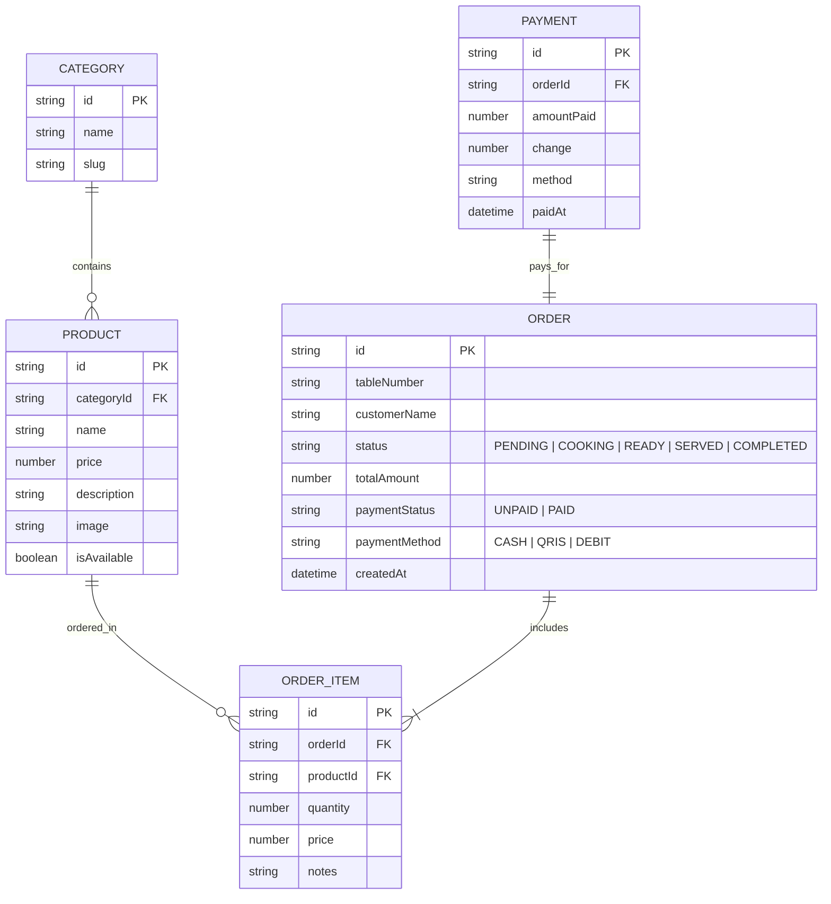

# Database ERD & Schema Specification — MyCashier

## Entities & Relationships

```mermaid
erDiagram
    CATEGORY ||--o{ PRODUCT : contains
    PRODUCT ||--o{ ORDER_ITEM : ordered_in
    ORDER ||--|{ ORDER_ITEM : includes
    PAYMENT ||--|| ORDER : pays_for

    CATEGORY {
        string id PK
        string name
        string slug
    }

    PRODUCT {
        string id PK
        string categoryId FK
        string name
        number price
        string description
        string image
        boolean isAvailable
    }

    ORDER {
        string id PK
        string tableNumber
        string customerName
        string status "PENDING | COOKING | READY | SERVED | COMPLETED"
        number totalAmount
        string paymentStatus "UNPAID | PAID"
        string paymentMethod "CASH | QRIS | DEBIT"
        datetime createdAt
    }

    ORDER_ITEM {
        string id PK
        string orderId FK
        string productId FK
        number quantity
        number price
        string notes
    }

    PAYMENT {
        string id PK
        string orderId FK
        number amountPaid
        number change
        string method
        datetime paidAt
    }
```
