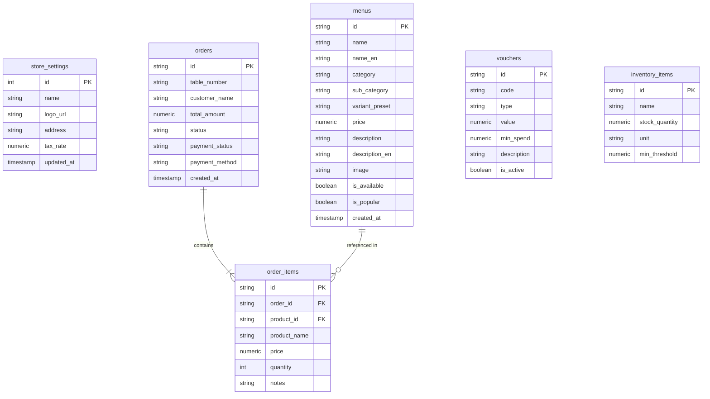

# Database ERD & Schema Design — MyCashier

## PostgreSQL Relational Schema (Neon Serverless)

---

## Table Definitions DDL SQL

Lokasi SQL DDL lengkap tersimpan pada [`src/lib/schema.sql`](file:///c:/Capstone/mycashier/src/lib/schema.sql).
